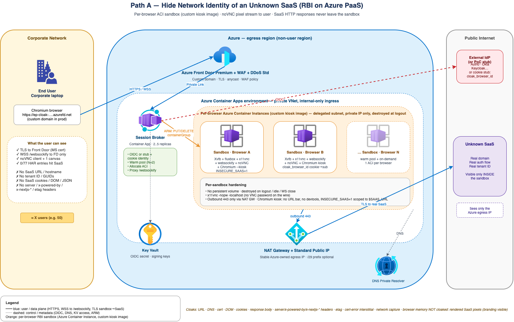

# Azure SaaS Network-Identity Cloak — Path A

> **Goal:** Let corporate users in Israel access an unknown third-party SaaS *without* the user being able to determine the destination's network identity (URL, DNS, tenant ID, headers, cookies, body) from any tool on their endpoint.
>
> **Scope:** This document covers **Path A** only — hide network identity. The user will still see the SaaS's rendered UI (branding visible). See §6 for what is explicitly out of scope.

---

## 1. Topology



Source: [topology.drawio](topology.drawio) — open in [draw.io](https://app.diagrams.net) or the VS Code drawio extension.

To regenerate the PNG after editing the `.drawio`:

```bash
/Applications/draw.io.app/Contents/MacOS/draw.io -x -f png -o topology.png topology.drawio
```

---

## 2. Customer requirements (as understood)

| # | Requirement | Status |
|---|---|---|
| R1 | Hide the destination **URL / domain** from the end user | ✅ in scope |
| R2 | Hide the destination's **tenant ID** (in URL, path, query, body, headers, cookies) | ✅ in scope |
| R3 | Hide the destination's **visual branding / UI** | ❌ **not solvable** for a SaaS the customer doesn't control — see §6 |
| R4 | The fact that "this is multi-tenant SaaS" is OK to expose | ✅ accepted |
| R5 | Withstand a **highly motivated adversary** with DevTools, packet capture, browser memory inspection | ✅ at network/DOM layer; ❌ at rendered-pixel layer |
| R6 | Auth to the destination is **whatever the SaaS demands** (not Entra-bound) | ✅ handled inside sandbox |
| R7 | **File upload** support to the SaaS | ⚠️ via streamer's controlled upload channel only (see §5) |
| R8 | No clipboard, print, camera/mic, USB, extensions, persistence, mobile, native clients | ✅ accepted — simplifies design |
| R9 | ~50 users, IL-based; egress region not required to be IL | ✅ |
| R10 | Customer prefers **PaaS / managed Azure services** over AKS | ✅ design uses ACA + Front Door, no AKS |
| R11 | SaaS ToS allows access via RBI | ✅ confirmed by customer |

---

## 3. Why reverse-proxy products failed (Netskope / Menlo / Cloudflare / on-shelf RBI)

| Product class | Why it failed for this customer | Why it can't be fixed |
|---|---|---|
| Netskope / Menlo / Cloudflare reverse-proxy | Could not strip tenant ID from **response body** (HTML/JS/JSON) at scale | None of these products rewrite response bodies for arbitrary SaaS — it's not a configuration gap, it's a category limitation |
| Cloudflare | Same — body rewriting not in product scope | Same |
| Their existing RBI | First user worked; **second user landed in the same pod and sessions mixed** | Implementation defect: shared/reusable pod model with insufficient per-user isolation. Pattern is correct, that vendor's isolation model was wrong |
| Azure Front Door / App Gateway / APIM | Header/URL rewrite only, **no response-body rewrite**, and several inject identifying headers (`X-Azure-Ref`, `Via`, `X-Forwarded-*`) | Built as origin-protecting reverse proxies, not anonymizers — by design |

**Conclusion:** The only viable category is **RBI (Remote Browser Isolation)** with **strict per-user isolation**. The RBI pattern works because the SaaS HTML/JS **never reaches the user** — they receive only a pixel/DOM stream. Tenant ID rewriting becomes irrelevant: the body never leaves the sandbox.

---

## 4. Solution overview — Azure-native PaaS RBI

| Layer | Service | Role |
|---|---|---|
| Public surface | **Azure Front Door Premium** + WAF + DDoS Std | TLS termination at `portal.contoso.com`, your cert, anycast, WAF |
| Auth gate | **Session Broker** (Azure Container Apps) | OIDC login (non-Entra IdP), allocates sandbox, issues signed session URL |
| Per-user sandbox | **Azure Container Apps — Dynamic Sessions** | Hyper-V isolated, 1 sandbox = 1 user, destroyed on logout. Custom container = Chromium + streaming server (Kasm / Neko / similar) |
| Egress | **NAT Gateway + Standard Public IP** (or `/29` Public IP Prefix) | Stable Azure WEU egress IP visible to the SaaS |
| DNS | **Azure DNS Private Resolver** | Region-consistent DNS resolution |
| Secrets | **Key Vault** | OIDC client secret, session-token signing keys |
| Identity | **External IdP** (Auth0 / Okta / Keycloak — customer choice) | Non-Entra OIDC for who can reach the cloak |
| Observability | **Log Analytics** + Front Door / ACA diagnostics | Audit + troubleshooting |

**Region:** `westeurope` (or `eastus` / similar) — explicitly **not** `israelcentral`.

### How a session flows

1. User opens `https://portal.contoso.com` → Front Door → Session Broker.
2. Broker bounces user to external IdP for OIDC login → user returns with a signed session token.
3. Broker calls **ACA Dynamic Sessions API** to allocate a fresh isolated sandbox for that user.
4. Broker returns a signed connect URL pointing at the sandbox's streamer endpoint, fronted via Front Door.
5. User's browser opens a **WebSocket** to the streamer; sees only pixels / virtualized DOM.
6. Inside the sandbox, Chromium navigates to the real SaaS, performs whatever auth the SaaS demands (password, MFA, SAML, OIDC, passkey if streamer supports WebAuthn forwarding).
7. SaaS sees the **NAT Gateway public IP** (Azure WEU) — never the corp IP, never the user.
8. On logout/idle/timeout the sandbox is destroyed. Next session = fresh sandbox.

---

## 5. What the user can and cannot see — the cloaking promise

| Vector | What user sees | Cloaked? |
|---|---|---|
| Browser URL bar | `portal.contoso.com/session/{id}` | ✅ |
| DevTools → Network tab | WebSocket frames to `portal.contoso.com` only | ✅ |
| DevTools → DOM / Elements | Streamer canvas / `<video>` element | ✅ |
| `View Source` | Streamer client HTML, no SaaS markup | ✅ |
| Browser cookies / IndexedDB / localStorage | Only fronting domain artifacts | ✅ |
| `nslookup` / OS DNS cache | Only `portal.contoso.com` | ✅ |
| Wireshark / `tcpdump` on user's laptop | Only TLS to Front Door anycast IPs | ✅ |
| Process memory of user's browser | Streamer state only — no SaaS HTML/JS/tokens | ✅ |
| OS-level packet capture | Same as Wireshark — Front Door only | ✅ |
| **Rendered pixels of the SaaS UI** | **The actual SaaS UI** — logos, layout, colors, data | ❌ — out of scope (R3) |
| Screenshot the screen | The SaaS UI is captured | ❌ |
| OCR a screenshot | Tenant name in the rendered text could be extracted | ❌ |

The cloaking promise is **network/DOM/storage layer**, not visual.

---

## 6. Constraints — what this design does **NOT** solve

This list must be reviewed with the customer. If any of these become must-haves, the design changes (or becomes infeasible).

### 6.1 Visual / pixel-level cloaking
- ❌ The user **will see the SaaS's UI** — branding, logos, color scheme, layout, data.
- ❌ A screenshot or screen recording captures the SaaS UI.
- ❌ OCR on a screenshot can extract any text rendered on screen, including a tenant name displayed by the SaaS.
- **Why:** No technology can render a SaaS's pages to a user *and* hide what those pages look like. The only solutions are (a) get an API from the SaaS and build a custom UI on top — separate project, separate path; or (b) accept the limitation.

### 6.2 SaaS apps incompatible with browser-in-a-browser
Some SaaS will **not function** inside an RBI sandbox even though network cloaking is fine. In particular:

| SaaS pattern | Why it breaks |
|---|---|
| **Azure Portal**, **Microsoft 365**, **Google Workspace**, **Salesforce** (and similar Tier-1 SaaS) | Heavy reliance on third-party cookies, Service Workers, WebAuthn passkeys with strict RP-ID binding, conditional access tied to device/IP, hardcoded redirect URIs in their OAuth flows. The login flow itself happens fine inside the sandbox, but **any feature that requires the user's local OS/device** (Smart Card login, Windows Hello, OS-bound passkey) cannot be forwarded |
| **WebAuthn with platform authenticator** (Touch ID, Windows Hello, OS-bound passkey) | The OS-bound credential is on the user's laptop, but the browser is the sandbox's Chromium. Origin RP-ID does not match. Most streamers cannot forward a platform authenticator, only roaming USB security keys |
| **Apps requiring browser extensions** (PGP, password managers, custom plugins) | Sandbox runs a clean Chromium; extensions are out of scope |
| **Apps requiring OS integrations** (smartcard middleware, certificate stores, file-system pickers beyond simple upload) | Sandbox OS is not the user's OS |
| **Apps depending on persistent device trust** ("remember this device" cookies) | Sandbox is destroyed at logout — fresh fingerprint every session. Expect frequent re-verification challenges |
| **Latency-sensitive or graphics-heavy apps** (video editors, 3D, real-time games) | RBI adds 60–100ms input lag; not for these |
| **Apps with aggressive bot detection** (Akamai BMP, PerimeterX, Cloudflare Bot Mgmt) | Fresh Azure-IP + fresh fingerprint per session = high false-positive rate. May challenge or block. Mitigation: register egress IP with the SaaS as a trusted source, if possible |
| **Native clients** (Outlook desktop, Teams desktop, IMAP, SFTP clients) | Out of scope — RBI is browser-only |
| **Mobile access** | Out of scope — desktop only |
| **Offline access** | Out of scope by definition |

> **Action required from customer:** Confirm with a 30-min PoC on the actual target SaaS *before* committing to the full build. If the target SaaS falls into any row above, revisit.

### 6.3 Adversary capability ceiling

| Adversary capability | Defended? |
|---|---|
| DevTools, F12, View Source on user's browser | ✅ |
| Wireshark / tcpdump on user's laptop | ✅ |
| Browser memory dump of user's browser | ✅ (only streamer state present) |
| Forensic disk capture of user's laptop | ✅ for SaaS data (none persisted locally); ❌ if user took a screenshot |
| **Screen recording / screenshot tools on user's laptop** | ❌ — pixel data is by definition visible to the user; cannot be defeated |
| **OCR on screenshots** | ❌ |
| **Photographing the screen with a phone** | ❌ — physically unsolvable by any software |
| Coercing the user (rubber-hose) | ❌ — out of scope of any tech control |
| User opening the real SaaS directly in another tab on the same laptop | ❌ — needs **endpoint policy** outside this design (Intune/MDM URL block on `*.saas.com`), or move the user to a managed device (Windows 365 / AVD) |
| Sandbox compromise & lateral movement to other tenants | ✅ — Hyper-V isolation per session, no shared state, no persistent volume; this is the explicit fix for the customer's previous RBI bleed bug |
| Compromise of the egress NAT IP reputation | ⚠️ — if SaaS rate-limits or flags the IP, all 50 users impacted simultaneously; mitigation = `/29` Public IP Prefix + rotation |

### 6.4 Operational constraints
- ❌ No persistent per-user profile inside the sandbox — by design. Means every session starts fresh, with re-login, re-MFA, re-device-trust challenges. **Adding persistence reintroduces the cross-user contamination risk** the customer's old RBI had. Do not relax this.
- ❌ User cannot bookmark deep-links into the SaaS — only the cloak's entry URL.
- ❌ No download of SaaS-issued OAuth tokens / API keys to the user's device — these would be visible inside the sandbox browser only.
- ⚠️ Cost is dominated by **session-second** billing of Dynamic Sessions. Idle sessions burn money — aggressive idle-timeout in streamer + broker-side reaper required.
- ⚠️ ACA Dynamic Sessions custom-container pools — verify regional availability and image-size limits at PoC time. Service is relatively new.
- ⚠️ Front Door + WebSocket through Private Link to ACA internal ingress — confirm WS upgrade behavior at PoC. If problematic, fall back to App Gateway v2 in front of ACA (Front Door still preferred for public surface; AppGW only if WS is fragile).

### 6.5 Compliance / legal
- ❌ This design does not establish whether using the SaaS via RBI complies with the SaaS's ToS for *all* features. Customer asserted "ToS allows it" — get this in writing, ideally per-feature.
- ❌ Data-residency analysis is **not done**. SaaS data flows out of `westeurope`; if any data is regulated as IL-only, this design violates it. Customer must confirm.
- ❌ Audit trail of *what users did inside the SaaS* is limited to network metadata (Front Door logs, NAT GW flows). **Session recording** of the rendered pixels can be added (Kasm and similar support it) but adds storage cost and retention obligations.

---

## 7. Open questions to confirm with the customer before build

These are the **load-bearing unknowns**. Without answers, the design is provisional.

1. **Which SaaS?** Without naming it we cannot verify HSTS, anti-bot posture, WebAuthn, API availability. A 30-minute test from a fresh Azure WEU IP is mandatory.
2. **Login walkthrough** — show me a screen-share of one user logging in today. Reveals auth method, IdP, MFA, redirects, passkey use, conditional access.
3. **Top 3 user journeys** — show end-to-end what users actually do. Reveals upload sizes, multi-tab needs, real session length.
4. **Endpoint posture** — corporate-managed with browser-policy push capability, or unmanaged? Determines whether endpoint controls (block direct `*.saas.com`) are available.
5. **Egress IP allowlisting** — does the SaaS care about source IP? If yes, our NAT Gateway PIP must be registered with them.
6. **Data residency** — any regulatory constraint preventing egress from `westeurope`?
7. **Acceptance test** — one concrete pass/fail criterion, e.g. *"User opens DevTools and Wireshark for 1 hour; cannot identify the destination domain or tenant ID."*

See [`questions.md` discussion](#) elsewhere in this conversation for the full list narrowed to 8 critical items.

---

## 8. PoC plan (recommended before full build)

| Step | Goal | Pass criterion |
|---|---|---|
| 1 | Single ACA Dynamic Sessions sandbox + Kasm + Chromium pointed at the actual SaaS | Login + 1 real workflow end-to-end |
| 2 | Front Door Premium + Private Link to sandbox via temporary domain | WebSocket stable, latency < 120ms RTT IL→WEU |
| 3 | Red-team test with DevTools + Wireshark + memory tools for 1 hour | Cannot identify destination domain, tenant ID, or any SaaS-specific string |
| 4 | 5 concurrent users → 20 concurrent users | Sandboxes remain isolated; no cross-contamination; cold-start < 3s |
| 5 | Cost telemetry on real workflows for 1 week | Per-user-month cost within budget envelope |
| 6 | SaaS bot/abuse posture | No CAPTCHA wall, no IP block from Azure WEU egress |

Only after all 6 pass → build production environment, broker, hardened image, IdP integration, observability.

---

## 9. Out-of-scope follow-ups (if customer requirements grow)

| If customer later asks for… | New design path |
|---|---|
| Hide visual branding too | **Path B** — requires SaaS API; build custom UI on App Service / Container Apps. Different project. |
| Defeat user on their own laptop (memory, screen recording) | **Path C** — move workflow to a device the user does not control: **Windows 365** or **AVD** with locked-down session host, no clipboard/print/screenshot, conditional access enforced. Even this does not defeat the "phone camera pointed at screen" attack. |
| Plain "hide corp public IP" (no SaaS-identity hiding) | **Path D** — VPN/ExpressRoute → AKS or VMSS with Envoy/Squid → NAT Gateway. Different stack entirely; Front Door would actually leak. Out of scope for this design. |

---

## 10. Files in this folder

| File | Purpose |
|---|---|
| `README.md` | This document |
| `topology.drawio` | Editable architecture diagram (open in draw.io) |
| `topology.png` | Rendered topology image referenced in §1 |
